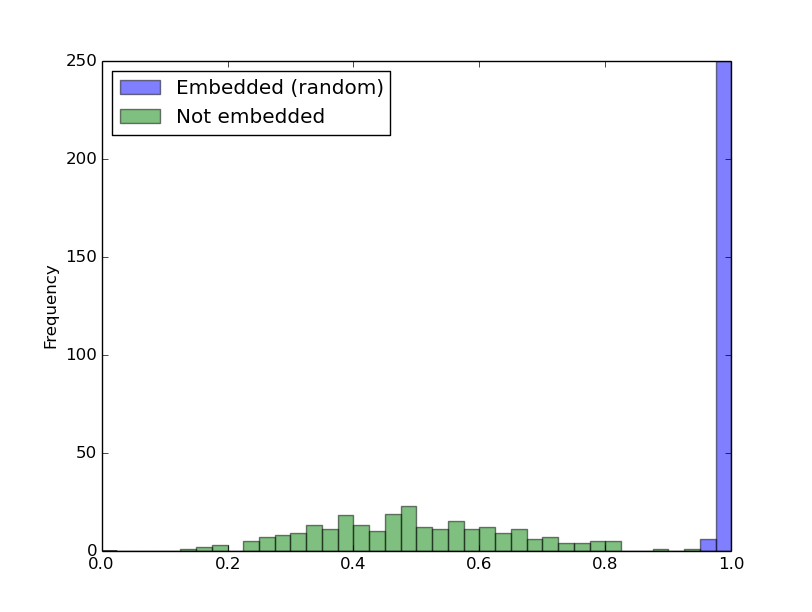

Embedding Watermarks into Deep Neural Networks
====
This code is the implementation of "Embedding Watermarks into Deep Neural Networks" [1]. It embeds a digital watermark into deep neural networks in training the host network. This embedding is achieved by a parameter regularizer.

This README will be updated later for more details.

## Requirements
Keras 1.1.2, tensorflow 0.12.0, numpy, matplotlib, pandas

 **[CAUTION]**
We found that custom regularizers had been deprecated in the latest versions of Keras as discussed [here](https://github.com/fchollet/keras/pull/4703).

> Custom regularizers may no longer work.

Therefore please use the old versions of Keras and TensorFlow.
(keras 1.1.2 does not work on tensorflow > 1.0.)

```sh
pip install keras==1.1.2
pip install tensorflow==0.12.0
pip install tensorflow-gpu==0.12.0
```


## Usage
Embed a watermark in training a host network:

```sh
# train the host network while embedding a watermark
python train_wrn.py config/train_random_min.json

# extract the embedded watermark
python utility/wmark_validate.py result/wrn_WTYPE_random_DIM256_SCALE0.01_N1K4B64EPOCH3_TBLK1.weight result/wrn_WTYPE_random_DIM256_SCALE0.01_N1K4B64EPOCH3_TBLK1_layer7_w.npy result/random
```

Train the host network *without* embedding:

```sh
# train the host network without embedding
python train_wrn.py config/train_non_min.json 

# extract the embedded watermark (meaningless because no watermark was embedded)
python utility/wmark_validate.py result/wrn_WTYPE_random_DIM256_SCALE0.01_N1K4B64EPOCH3_TBLK0.weight result/wrn_WTYPE_random_DIM256_SCALE0.01_N1K4B64EPOCH3_TBLK1_layer7_w.npy result/non

# visualize the embedded watermark
python utility/draw_histogram_signature.py config/draw_histogram_non.json hist_signature_non.png
```

Extracted watermarks from the embedded host network and the non-embedded networks:



## License
All codes are provided for research purposes only and without any warranty.
When using any code in this project, we would appreciate it if you could refer to this project.


## References
[1] Y. Uchida, Y. Nagai, S. Sakazawa, and S. Satoh, "Embedding Watermarks into Deep Neural Networks," ICMR, 2017.
